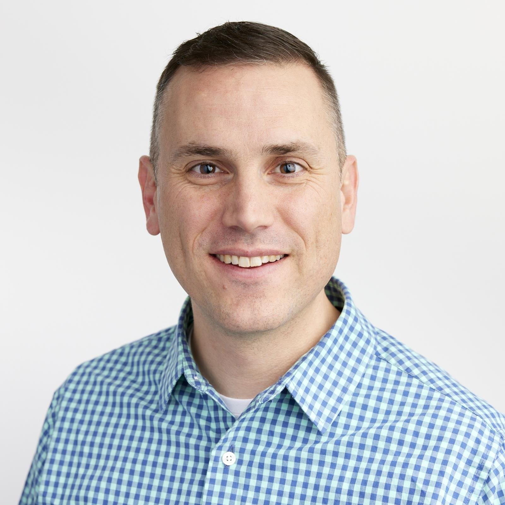

# Aside

{width="80%"}

## Brian Davidhizar {#contact}

-   <i class="fa fa-envelope"></i> [brian.davidhizar\@gmail.com](mailto:brian.davidhizar@gmail.com){.email}
-   <i class="fa fa-phone"></i> +1 667-272-6601
-    [linkedin.com/briandavidhizar](https://www.linkedin.com/in/briandavidhizar/)
-   For more information, please contact me via email.
-   **U.S. Citizen**

## Career Summary {#skills}

-   U.S. Marine Corps (2003-2008)
-   PricewaterhouseCoopers (2008)
-   Arthur Bell CPAs (2008-2010)
-   T. Rowe Price (2010-2022)
-   Ramsey Solutions (2022-2024)
-   K-LOVE, Inc. (2024-Present)

## Learning Growth

- Messiah Univ (1998-2002)
- U. MD Global Campus (2006-2009)
- RIT (2011-2012)
- Univ. of Washington (2012-2013)
- CFA Inst. CIPM Prog. (2013-2014)
- Norwich Univ (2016-2018)
- CMU Tepper Sch. of Bus. (2020-2021)
- Eastern Univ (2022-2023)

 

*Last updated on `r Sys.Date()`.*

# Main

## Extended CV {#title}

This document is supplemental to [**Brian Davidhizar's CV**](https://htmlpreview.github.io/?https://github.com/Bravo-Lima-Delta/BLDavidhizarCV/blob/main/Brian-Davidhizar-CV.html) as an appendix.

## Career Narrative {data-icon="suitcase"}

### [United States Marine Corps](https://en.wikipedia.org/wiki/United_States_Marine_Corps)

[Signals Intelligence](https://en.wikipedia.org/wiki/Signals_intelligence): [Spanish Cryptologic Linguist](https://militaryyearbookproject.org/references/military-occupation-codes/usmc/field-26-signals-intelligence-ground-electronic-warfare/mos-2674-european-i-west-cryptologic-linguist)

[Fort Meade, MD](https://en.wikipedia.org/wiki/National_Security_Agency)

2003 - 2008

**Pursuit of the role:**

-   I spent a considerable amount of time reflecting on what I wanted to do after college while I was a student at Messiah University. The military option was one that I started considering my sophomore year. I started taking the idea more seriously my junior year. The Marine Corps was the only branch of service I ever considered. I suppose I wanted to be part of a highly esteemed organization that would live up to its reputation of instilling discipline, building character, developing leadership skills, and taking their work seriously. The September 11th attacks took place at the beginning of my senior year, and I elected to enlist, rather then put in an officer package, so I could go into intelligence and study languages.

**What I helped accomplish and why it mattered:**

-   I assisted U.S. efforts in the fight against narco-trafficking. Anyone who understands the destructive impact of narcotics can understand why it was easy for me to derive a lot of meaning from the mission.
-   Completed an A.A. in Spanish at the Defense Language Institute in August, 2005.

**Learnings:**

-   What I learned in the Marines are lessons that will never decay. They are too numerous to be captured here, but I provide a few important ones listed in no order of precedence:
-   How to endure and overcome challenges
-   The importance of guarding your reputation
-   There will always be another evaluation, let each of them be a learning opportunity.
-   Perception is reality.
-   Put others first. Humility is not weakness.
-   There is such a thing as terrible leadership.
-   Good leadership takes intentional effort and training.
-   Not every fight is worth fighting, but when you do, know how to win.

**Aspirations:**

-   I loved being a Marine. I thought I might stay in the Corps for a long time because I was good at it and I liked the way the uniform made me feel. I fell in love, though, and judged that the Marines was not an environment conducive for a healthy family life. I reflected on the coursework I enjoyed during my undergraduate studies and determined that I would pursue a career in financial analytics of some sort and with a specific eye toward the investments industry. I thought that an investments career would help provide for the family life we wanted. Really, I just wanted to make ends meet after getting out of the military.

### [PricewaterhouseCoopers LLP](https://en.wikipedia.org/wiki/PricewaterhouseCoopers)

Assurance Associate

Tysons Corner, VA

2008 - 2008

**Pursuit of the role:**

-   I needed a job that would offer an income similar to the income I was earning in the military. PwC took me on primarily, I believe, because I had an active Top Secret security clearance and they had government contracts on which they thought I would be a good fit. From my perspective, however, they put forth very little effort in terms of training provision and I quickly judged that it was not in my best interest to be shell-holed into government contracting when my intent was to navigate toward an investments career.

**What I helped accomplish and why it mattered:**

-   I assisted with audit work at Howard University in D.C. and then helped a government agency with audit preparations. I felt that very little of what I did made any sort of significant contribution to the overarching missions of these organizations. However, my time at PwC came with other important lessons (see learnings).

**Learnings:**

-   I started to get a sense of how far behind I was of peers that had already been in the workforce for 5 years while I had been on military duty.
-   I realized I lacked a deep understanding of basic everyday business tools (e.g. MS Excel, MS PowerPoint, etc.) and adopted strategies for building expertise in them.
-   I began to understand that completing a graduate degree was paramount if I wanted to portray a seriousness about professional progression, so I studied hard while pursuing an M.S. in Accounting and Financial Management at the University of Maryland Global Campus (UMGC).

**Aspirations:**

-   One of my classmates at UMGC was an associate at a Arthur Bell CPAs, a public accounting firm north of Baltimore that specialized in providing assurance and tax services to clientele in the alternative investments industry (e.g. hedge funds, commodity pools, funds of hedge funds, etc.). I thought joining a firm like that would be the perfect way to gain professional experience while simultaneously aligning my career with to the industry that most peaked my interest.

### [Arthur Bell, CPAs](https://www.cohencpa.com/arthur-bellhttps://rocketreach.co/arthur-bell-merged-with-cohen-company-profile_b5c0a2e2f42e084b)

Hedge Fund Audit Staff

Hunt Valley, MD

2008 - 2010

**Pursuit of the role:**

-   I joined Arthur Bell CPAs as Audit Staff in June, 2008 after a short stint at PricewaterhouseCoopers. I had been studying Accounting and Financial Management at UMGC and I felt this role would give me more hands-on experience in the accounting field. I was also excited about moving closer to the investments industry, even if did not yet involve working for an investment manager directly.

**What I helped accomplish and why it mattered:**

-   I helped complete audits of alternative investments partnerships (e.g. hedge-funds, commodity pools, funds-of-hedge-funds, etc.). I audited various parts of their financial statements to include both Balance Sheet and Income Statement items under the supervision of more tenured audit associates. As an independent auditor, our opinion as to whether any material misstatements existed helped give investors in the partnerships confidence that business was being conducted properly.
-   Completed M.S. in Accounting and Financial Management from UMGC in May, 2009.

**Learnings:**

-   Developed knowledge of the alternative investments industry
-   Better understanding of and deeper exposure to financial statements
-   Introduced to different types of financial securities traded by investment managers for different purposes such as equities, bonds, futures, forwards, options, swaps, etc.
-   I learned that I enjoy structure around process. In other words, I learned that I like clear goals and systematic ways to go about achieving them. Auditing was often a direct, step-by-step process, so it was good to have this type of work at the introductory stage of my professional career.

**Aspirations:**

-   Public accounting firms typically operate with a busy season, which entails extended working hours from January through April -- usually 12-15 hours a day with some work on Saturdays as well. This arrangement was not sustainable from my point of view; I did not want to be working busy seasons that would preclude any chance of being present as a father. Additionally, I began to find the historic nature of audit work tedious; I wanted to be in a role that was more participatory: where I could help solve business problems. I thought that pursuing roles at Baltimore-based investment firms like T. Rowe Price or Legg Mason (recently acquired by Franklin Templeton) would provide a transition into direct employment by an asset manager.

### [T. Rowe Price](https://www.troweprice.com/corporate/us/en/what-we-do.html)

Sr. Mutual Fund Accounting Associate

Owings Mills, MD

2010 - 2011

**Pursuit of the role:**

-   I had set a goal of working directly for an asset manager, so I searched for roles at T. Rowe Price that would be a good fit considering the skills I had acquired at Arthur Bell CPAs. I successfully managed to land a role in T. Rowe's Portfolio Accounting department. I hoped that it would be a role that could provide future opportunities and multiple paths into other investment-related analytic roles.

**What I helped accomplish and why it mattered:**

-   I had two primary responsibilities as a portfolio accountant. The first was to reconcile transactions (e.g. buy/sell trades, corporate actions, receipt of interest, etc.) in our systems to custodian records for fixed income portfolios. The second was to manage the distribution of corporate shares to institutional clients from their ownership interests in private equity and venture capital partnerships. T. Rowe Price investment staff would then manage the liquidation of the shares on the client's behalf or hold them for eventual sale at a future date. I worked with T. Rowe Price Technology associates to build a more robust, controlled, and more automated system for booking these shares to reduce the probability of error. I also helped develop and improve MS Excel macros to automate certain elements of client reporting related to this particular client set.

**Learnings:**

-   Gained familiarity with portfolio accounting systems.
-   Built an understanding of the what goes on within an investment portfolio at transaction-level detail.
-   Learned how investment managers, their clients, and their client's custodian all work together to coordinate the processes that build wealth for the client.
-   I realized I enjoy the rewards that accompany the refining of business processes.

**Aspirations:**

-   After a year of serving as a portfolio accountant, I was eager to acquire exposure to more technical aspects of investing. I did not feel as if I had enough experience to apply for highly competitive positions on the investment staff without it. However, I knew other available roles at T. Rowe could provide an opportunity to build the type of knowledge that could give me a shot at an investment staff position in the future. I knew I wanted something that would provide the opportunity to learn about how to measure portfolio performance and how T. Rowe's investment products compared to competing firms.

### T. Rowe Price

Quantitative Investment Performance Analyst

Owings Mills, MD

2011 - 2015

**Pursuit of the role:**

-   I successfully transitioned to a Quantitative Performance Analyst position in T. Rowe's middle office. In this role I developed deep skills in investment portfolio analysis and trained portfolio analysts on portfolio analysis tool usage and data interpretation. I acquired a deeper knowledge of portfolio return calculation, Modern Portfolio Theory (MPT), investment performance statistics (e.g. alpha, beta, tracking error, information ratio, sharpe ratio, etc.), portfolio benchmarks, and excess return attribution analysis.

**What I helped accomplish and why it mattered:**

-   Provided CEO and Senior Members of Investment Staff with Lipper Ranking statistics and performance trends of all T. Rowe Price funds. This helped executives more closely monitor how T. Rowe's product line compared to industry competitors on a day-by-day basis.
-   Leveraged various software applications to supply returns-based style charts and MPT statistics to investment staff and marketing professionals. Maintained an understanding of how such statistics are being calculated by the tools. Providing this type of information provided greater transparency and awareness that T. Rowe's investment strategies were behaving as intended.
-   Utilized other software applications to perform attribution analysis and assist in the interpretation of such analysis with end-users as needed. This helped investment associates why their investment strategies were outperforming or underperforming their respective benchmark indices.
-   Performed ad-hoc portfolio/universe ranking, competitor, and performance analyses using Morningstar Direct. Produced various (sometimes standardized) reports, and fulfilled such requests to end-users in a cognizant way. This helped provide timely information to investment associates so that they could operate at peak performance.

**Learnings:**

-   Providing great support strengthens the entire team and makes everyone better.
-   I discovered I enjoy teaching and training others.
-   Acquiring technical expertise is valuable in itself and takes significant time and effort to build.
-   I became aware of the vastness of the investments industry (i.e. the hundreds/thousands of managers world-wide who compete for the same pot of client assets changing hands at any given moment)
-   Studied Applied Statistics at Rochester Institute of Technology (2011-2012) and transitioned into a Computational Finance Graduate Certificate program at the University of Washington (completed 2013).\
-   First started programming in R in 2013. I started realizing I may not have the passion or skill it takes to be a quantitative investor.\
-   Earned the Certificate in Investment Performance Measurement from the CFA Institute (2014).

**Aspirations:**

-   After 3^1/2^ years as a performance analyst, I reasoned that it might be beneficial to learn a different part of the business and support the institutional sales staff in their market research efforts. Maybe I could build relationships that would lead me into investments.

### T. Rowe Price

Sr. Market Research Analyst

Baltimore, MD

2015 - 2016

**Pursuit of the role:**

-   I went back and forth with the decision to accept the position offered to me supporting institutional sales associates. Ultimately, I elected to go through with it because I felt it would be beneficial to have a broader understanding of the firm instead of niche expertise in portfolio performance evaluation.

**What I helped accomplish and why it mattered:**

-   I provided direct support to North America-based Global Institutional Sales, Consultant Relations, & Client Service teams and Global Marketing Initiatives.\
-   I helped provide background context on competing investment strategies to distribution associates so that they could be fully prepared for finals presentations and be better positioned to win institutional mandates.
-   I started using data visualization tools like Tableau to present insights from underlying datasets instead of hacking through the data using MS Excel. Exhibiting the power of Tableau helped provide momentum to broader business intelligence initiatives that were just getting underway. Now several distribution units have mature data analytics teams.
-   I established a high level of familiarity and comfort with industry platforms like Morningstar Direct, eVestment, and SIMFUND that contain AUM, asset flow, and peer-group performance ranking data.

**Learnings:**

-   I learned how to work and meet deadlines in a demanding, high-tempo, sales environment.
-   I started learning how to refine and simplify data presentations so that they could easily understood by people with little background knowledge. This helped improve speed of communication and understanding among fellow associates and clients.
-   I helped develop a way to identify "weak managers" in various market spaces that were susceptible to being fired. This helped our organization identify opportunities where we might replace the incumbent and win more mandates.

**Aspirations:**

-   Working alongside the distribution associates was not my favorite. I did not feel as if my values were aligned with the culture of the group. It was a money culture I was unfamiliar with and did not know how to navigate. I realized that I certainly did not aspire to become a distribution representative. However, before beginning any sort of broader search for a new role, there were other enterprise-level developments taking place that would dictate how I would contribute to T. Rowe's growth in the coming years.

### T. Rowe Price

AVP, Product Analyst

Baltimore, MD

2016 - 2018

**Pursuit of the role:**

-   During the 2015-2016 timeframe, T. Rowe Price had engaged a consultant to help navigate various strategic development challenges. One of the outcomes of that work was the creation of a Global Product Group whose primary role would be to spearhead product development. The group was staffed by lifting out associates from their current roles. I was selected by the Global Head of Distribution to be one of the original associates of the Product Strategy Group within the new division to help with top-priority product research efforts. I was excited to be chosen and involved in such an important initiative.

**What I helped accomplish and why it mattered:**

-   Compiled a body of research on "High Conviction" Equity Strategies which lead to the launching of several new investment strategies to include European Select Equity, Global Select Equity, and U.S. Select Value Equity.
-   Analysis of Japan Equity scaling opportunities. At the time, the T. Rowe Price Japan Equity strategy had less than \$1B of AUM mostly sourced from U.S. investors. My research helped identify that EMEA could be a significant source of assets. The strategy now has over \$5B in assets mostly driven by EMEA investors.
-   Researched the China Equity market-space to determine what type of China Equity product T. Rowe Price should bring to market. T. Rowe now has multiple China Equity product offerings available.\
-   Dynamic Emerging Markets Bond product development, which is now live, and also helped review product launch opportunities in the UK OEIC market, leading to several additional vehicle launches there.\
-   I helped assess whether T. Rowe Price should register with the CFTC as a Commodity Pool Operator/Commodity Trading Advisor. This helped the firm stay on course with alternative investment product offerings.
-   Application of business intelligence tools such as Tableau and Microsoft Power BI to analytical processes, case-building, and storytelling.

**Learnings:**

-   I gained more confidence communicating with data.
-   I feel rewarded when I am entrusted with important work.
-   I enjoy contributing to the growth and development of an organization.
-   I like activities that have a global component (i.e. not U.S.-specific).
-   I get satisfaction from trying new ways of accessing, processing, and visualizing data.
-   I learned a lot about myself and about leadership while completing and M.S. in Leadership from Norwich University.

**Aspirations:**

-   I loved my work as a Product Analyst. During this time period I shifted my focus and career goals away from Investments work. I began to realize that I was acquiring significant industry and data knowledge that might be put to use at an enterprise level.

### T. Rowe Price

VP, Sr. Manager, Data Analytics

Owings Mills, MD

2018 - Present

**Pursuit of the role:**

-   I joined an associate that had been working on the Corporate Strategy team to FP&A where we would be interfacing with the Investments and Product divisions to help them formulate their strategic plans. The dynamics of the Product group had been changing, and I thought that the opportunity in FP&A would lead to a greater understanding of how the business functioned from a financial perspective. I thought that this exposure would help set me up for more senior responsibilities at the firm or at another asset manager. It appeared there would be plenty of opportunity to use my product, industry, investments, and analytics knowledge to make an impact.

**What I helped accomplish and why it mattered:**

-   Collaborated on several strategy-oriented projects including a strategic review of International Equity business unit which contributed to the development of strategic priorities for the new Head of International Equity.
-   Strategic analysis of seed capital deployment as it pertains to product roadmaps. This helped the firm understand if deployment of seed capital was being put to highest and best use.
-   Continued to apply concepts from the data science lifecycle to import, tidy, transform, visualize, model, and communicate data stories. I built experienced in implementing Microsoft PowerQuery (PowerBI/Excel) and R tidyverse functionality to perform ETL processes on multi-sourced data sets. I Established data ingestion processes, cleaned and organized data, and creatively charted data stories that provided key takeaways to internal clients through clear, concise presentation.
-   I pioneered the development of a PowerBI dashboard from multi-sourced data that allows for visualization and analysis of investor research spend, data spend, and travel spend across all business units allowing for greater transparency and firm wide cost monitoring.

**Learnings:**

-   I realized the importance of refining my analytics skill-set more intentionally. I applied and was accepted into Carnegie Mellon University's Tepper School of Business M.S. in Business Analytics program, one of the top programs in the U.S.
-   Despite a strong work-ethic, I have limits. I was unable to juggle the rigorous coursework alongside the onset of COVID, family responsibilities, and professional workload. It was difficult to justify spending hours of time learning AI/ML techniques when there would be no immediate opportunity to apply the skills in my day-to-day work. Choosing to drop from the program was a hard choice.
-   There is more than one way to keep learning. I was determined to continue my data science, analytics, and data visualization skill-building journey. I became a Certified Data Scientist Professional through Datacamp's certification platform and have also earned the Certified Tableau Desktop Professional credential.

**Aspirations:**

-   Much reading and self-reflection led me to a point in my career where the alignment of values and being part of something "bigger" was paramount. I searched for roles that existed more squarely within a data analytics or business intelligence team in an organization where I could belong, learn, grow, mentor, and influence.
-   Also during the period I watched senior leaders at T. Rowe Price struggle with work-life balance.  I observed how much time they were spending at their computers instead of with their families.  Maybe this comes along with executive level responsibilities, but I could not see myself growing up into their roles.  That type of life was not something I aspired to.

### [Ramsey Solutions](https://www.ramseysolutions.com/)

Data Analyst II

Franklin, TN

2022 - 2024

**Pursuit of the role:**

-   Throughout our relationship, my wife Heidi and I have worked hard to be financially responsible.  We've paid off debt and are serious about our long-term financial goals.  Dave Ramsey's financial literacy curriculum was a big part of building that mindset.  I applied to a Data Analyst role at Ramsey Solutions in January of 2022, interviewed in person in February, and started in March of that year.  It was a very fast transition; quite faster, in fact, than most experience through Ramsey's rigorous hiring process.  Heidi and I were excited to start a new journey and adventure, but this did not come without challenge and sacrifice. I committed to a +25% pay cut with the rationale being that what I would forego financially I would recoup culturally.  We made the finances work (barely).  The culture at Ramsey was awesome and exactly what I needed at this point in my career.  It was such a good fit in so many ways!

**What I helped accomplish and why it mattered:**

-   The main role at Ramsey was focused on reinvigorating a "squad" of marketers, designers, and copywriters responsible for optimizing digital ad spend (primarily on Google's ad platform).
-   I helped speak into and evaluate RamseyTrusted Real Estate website performance and ad spend associated with driving website traffic.  i.e. audience starts on a Google search page, sees an ad, converts through the ad to a Ramsey Real Estate landing page, finds what they need on the Ramsey site and and eventually becomes a Ramsey consumer.
-   I took on a role that extended beyond data analysis: one that was more leadership oriented than I ever anticipated.  When I started, I walked into a squad that wasn't communicating with one another very well, that didn't have clear, shared goals or vision, and wasn't held out as a high performing squad.  When I left, our squad had rediscovered our own strengths, capabilities, and unique position in the RamseyTrusted ecosystem.  We were being held out as an example to follow.  We certainly believed in each other and all felt uniquely valuable to our individual squad and to the business as a whole.

**Learnings:**

-   Think hard before taking a 25% pay cut.  In hindsight, I achieved my ends and transitioned to a culture that was much more aligned with my values and inpspirational needs. Again, I really needed this.  However, the career pivot to a lower-tiered tech role and and transition to a professional discipline other than what I had been practicing over the past decade came with a slower salary growth trajectory than I anticipated.  Some of this could be tied to the economics of Ramsey Solutions' business as a whole.   
-   Digital-advertising-spend-optimization, landing-page-optimization, and everything related to the digital marketing discipline was "miles away" from the type of work I had been doing at T. Rowe Price. It was certainly a lot to learn: something I've always invited. It helped me realize that I can "hook in" to a new problem set and have just as much success solving problems as I had before in the investments community.
-   Learned to think like a marketer and focus on actual consumer behavior in real time, rather than simply looking at historic, after-the-fact trends (e.g. asset flows & AUM growth) like I did at T. Rowe in the asset management industry.
-   Adopted a more creative and innovative mindset.  Helped birth the concept of landing pages such as the following: https://www.ramseysolutions.com/real-estate/us/tn/spring-hill
-   I learned that I'm a leader, that people/peers look up to me.  They respect my willingness to teach and communicate at a level that's deeply personal, sensitive, and that inspires personal growth and dedication to the mission.
-   During my time at Ramsey, I reminded myself why I had started the Business Analytics program at Carnegie Mellon.  I found a more flexible and cost effective program and completed an M.S. in Data Science through Eastern University while working full time.  The coursework help me make more meaningful contributions at Ramsey and set me up for success at K-LOVE, Inc.

**Aspirations:**

-   I did not want to leave Ramsey Solutions, but did so as a matter of principle and integrity.  I struggled to reconcile certain dissonance around "practicing what you preach" particularly in the area of borrowing.  I wasn't willing to 'toe the line' with certain experiments that involved usage of trademarked assets that didn't belong to Ramsey.  Some people thought it was a "gray area."  It wasn't for me.  Leaving Ramsey was not a pleasant experience because I had put so much stock into the idea of it, moved my family across the country, and then realized that the organization and certain pockets of leadership weren't really focused on Kingdom-building as maybe it had been in the past.  From my perspective, it was mostly just business.  It was a disillusioning experience. But, 8 weeks later, God provided a new role for me.  He is faithful.  

### [K-LOVE, Inc.](https://www.klove.com/about/mission)

Data & Business Systems Analyst III

Franklin, TN

2024 - Present

**Pursuit of the role:**

-   God provided a role at K-LOVE: a notable radio/media ministry that broadcasts across the United States (and now internationally).  The main mission of K-LOVE is to inspire people to move closer to Jesus and their new HQ is a few hundred yards away from Ramsey's campus.  It's incredible to be doing ministry and part of something so impactful.  I never question the value and importance of our work--it truly changes lives.  Watching people refocus spiritually and become better disciples helps me stay focused and motivated.

**What I helped accomplish and why it mattered:**

-   I was brought on to be a facilitator and project manager of data & analytics projects. My role focuses on building relationships within the ministry, collecting data requirements, understanding business needs, creating project plans, timelines, milestones, etc. and getting the work done.  Sometime we deliver dashboards.  Sometimes we start ingesting new data.  Sometimes we help create new data products that help people understand their environment and/or operate more efficiently/effectively.  It's very much akin to internal consulting.
-   I helped rollout our team's adoption of Asana, a work managment platform.  It streamlines our work, establishes a shared sense of ownership, and helps keep us maintain accountability toward delivering ministry goals.
-   I have been spearheading and influencing the adoption of AI within the ministry by demonstrating how to more efficiently code, visualize information, use it as a thought partner, and compress time-to-delivery.  This has been especially powerful and important for team members who are earlier in their career who have benefited from the realization that AI is here to stay and mastering capabilities in that area will serve them well in the long term.

**Learnings:**

-   Ministry is important and plays a vital role in society and in the lives of those who serve, even if it's only for a time.
-   Ministry doesn't pay what the market pays.
-   Ministry is prone to the same leadership problems that exist within secular operations; some people's heart isn't in the work.
-   Ministry needs bright people and it can be hard to find them along with the right culture fit.
-   Unity of vision and the establishment of clear goals and accountability is a vital part of organizational health.  If leadership doesn't get this right, success becomes much more difficult

**Aspirations:**

-   Although God called me to ministry here in Tennessee, I can see that it may only be for a time.  Radio as a platform is slowly dying, and competing for time, attention, and dollars in the digital space is a real challenge.
-   Over the past 2 years, our organization has had turnover in the following C-level roles:  Chief Executive Officer, Chief Media Officer, Chief Technology Officer, Chief People Officer, Chief Radio Officer, and Chief Financial Officer (the last 4 within a 60-day time frame).  To me, this is an indication of leadership discord and or a lack of confidence in where the organization is headed.  Despite its strong mission/intent, I do not see myself contributing long-term to an organization with so much volatility at the top.  
-  I'm looking for a more stable organization.  I would like to be somewhere that aligns missionally/culturally to who I've been in the past (i.e. the seriousness with which they approach their work) and that can sustain who I can become in the future.
-   Given my background in the investments industry, I believe it wise to not let too much time pass before looking to re-enter the marketplace.  I've been building relationships through CFA Society Nashville to gauge what different professionals are working on and searching for opportunities that might make sense for someone with my background.

### [More Than Financial Coaching LLC](https://mtfc.coach)

Founder & Coach

Franklin, TN

2026 - Present

**Becoming a Professional Coach:**

-  I completed the first stage of professional coach training through Brentwood Baptist's Center for Christian Coaching (accredited by the International Coaching Federation).  
-  I'm working toward becoming a professional coach primarily for the edification of people who find themselves in professional challenges that require intentional strategies and change.  
-  I've never been an entrepreneur, so I've been learning how to be my own spokesperson, manage and stand-up my own website, do my own digital marketing and branding, and produce my own content.  I established an LLC in February of 2026.  
-  I believe the coaching training and practical application I've acquired of the past years allows me to be an extremely strong enabler of other professional who are working hard toward goals they care deeply about.
