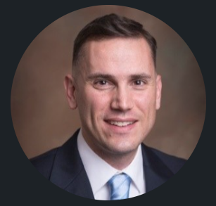

Aside
================================================================================

{width=80%}

Contact Info {#contact}
--------------------------------------------------------------------------------

- <i class="fa fa-envelope"></i> brian.davidhizar@gmail.com
- <i class="fa fa-phone"></i> +1 443-422-7183
-  [linkedin.com/briandavidhizar](https://www.linkedin.com/in/briandavidhizar/)
-  [datacamp.com/briandavidhizar](https://www.datacamp.com/profile/briandavidhizar)
- <i class="fa fa-github"></i> [github.com/Bravo-Lima-Delta](https://github.com/Bravo-Lima-Delta)
- For more information, please contact me via email.
- **U.S. Citizen**

Skills {#skills}
--------------------------------------------------------------------------------

- Experienced financial data analyst in the asset management industry

- Learner, Teacher, Collaborator

- Credentialed in Leadership, Data Science, Tableau, Investment Performance Analysis, Accounting & Financial Management

- Competent primarily with R, Power BI, Tableau, and secondarily with Python, SQL

Disclaimer {#disclaimer}
--------------------------------------------------------------------------------

This resume was made with the R package [**pagedown**](https://github.com/rstudio/pagedown).

Last updated on `r Sys.Date()`.

Main
================================================================================

Brian L. Davidhizar {#title}
--------------------------------------------------------------------------------

### Senior Data Analyst at Ramsey Solutions

**Please refer to an [Extended CV](https://htmlpreview.github.io/?https://github.com/Bravo-Lima-Delta/BLDavidhizarCV/blob/main/Brian-Davidhizar-CV-Appendix.html) for career narrative and details of major projects and accomplishments.**

Education {data-icon=graduation-cap data-concise=true}
--------------------------------------------------------------------------------

### Norwich University

M.S. in Leadership

Northfield, VT

2018

### University of Washington

Graduate Certificate in Computational Finance

Seattle, WA

2013

### University of Maryland Global Campus

M.S. in Accounting & Financial Management

Adelphi, MD

2009

### Defense Language Institute

A.A. in Spanish

Monterey, CA

2005

### Messiah University

B.S. in International Business

Mechanicsburg, PA

2002

Data Analytics & Industry Skills {data-icon=laptop}
--------------------------------------------------------------------------------

### Data Science

Datacamp

Online Platform

Present - 2019

::: concise
- *[Certified Data Scientist Professional](https://www.datacamp.com/certificate/DS0015434165441)*
- Data Scientist with R
- Data Analyst with R
- Data Visualization with R
- Data Manipulation with R
- Data Analyst with Python
- Data Analyst with SQL Server
:::

### Analytics & Programming

Various Platforms and Tools

Various Learning Modes

Present - 2013

::: concise
- *[Certified Tableau Desktop Specialist](https://www.credly.com/badges/6c91ed7f-895b-4ebb-b47a-df549d52d02b/public_url)*
- Microsoft Power BI
- DAX
- R
- Python

:::

### Investments Industry

Data Platforms

T. Rowe Price

Present - 2010

::: concise
- Morningstar Direct
- eVestment
- Strategic Insight/SIMFUND
- P&I Research 
- Zephyr StyleAdvisor
- Factset
- Lipper
- Mercer Insight
:::

Professional Experience {data-icon=suitcase}
--------------------------------------------------------------------------------

### Senior Data Analyst

Ramsey Solutions

Franklin, TN

Present - 2022

### Sr. Manager, Data Analytics (current) | Product Analyst | Sr. Market Research Analyst | Quantitative Investment Performance Analyst | Sr. Mutual Fund Accountig Associate

T. Rowe Price

Baltimore, MD

2022 - 2010

::: concise
- Data Visualization & Storytelling
- Dashboard Development
- Strategic Analysis
- Investment Product Development
- Investment Vehicle Analysis
- Industry & Competitor Analysis
- *[Certificate in Investment Performance Measurement (CIPM)](https://www.cfainstitute.org/-/media/documents/factsheet/cipm-factsheet.ashx)*
- Analysis of Assets Under Management (AUM) and Net Flows
- Institutional Sales & Client Service Support
- Monte-Carlo Simulation
- Forecasting
- Portfolio Accounting
:::

### Hedge Fund Audit Staff

Arthur Bell, CPAs

Hunt Valley, MD

2010 - 2008

- Auditing of hedge funds, commodity pools, and fund-of-funds.

### Assurance Associate

PricewaterhouseCoopers, LLP

Tysons Corner, VA

2008

- Big 4 Experience

Active Duty Military Service {data-icon=suitcase}
--------------------------------------------------------------------------------

### Signals Intelligence: Spanish CryptoLinguist (MOS: 2674)

United States Marine Corps

Fort Meade, MD

2008 - 2003

- Intensive military training in basic combat operations,
foreign language, intelligence production, and information technology application.

::: concise
- Ranks: PFC - Sergeant (E2-E5)
- Discharge: Honorable
- Joint Service Achievement Medal
- Navy and Marine Corps Achievement Medal
- Army Achievement Medal
- Joint Meritorious Unit Award
- Marine Corps Good Conduct Medal
- National Defense Service Medal
- Global War on Terror Service Medal
- **Inactive TS/SCI Clearance**
:::

Other Quant Coursework & Interests {data-icon=file}
--------------------------------------------------------------------------------

### Carnegie Mellon University - Tepper School of Businesss

Graduate Coursework in Business Analytics

Pittsburgh, PA

2021 - 2020 

### Rochester Institute of Technology

Graduate Coursework in Applied Statistics

Rochester, NY

2012 - 2011

### Interests

Short list:

Everywhere

::: concise
- European Football (Soccer)
- Leadership Literature
- Data Visualization
- Military History
- Geography
- Travel
- Hiking
- Theology
:::
